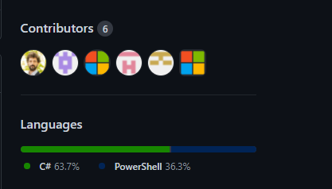
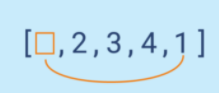
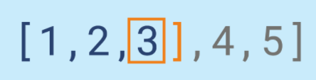
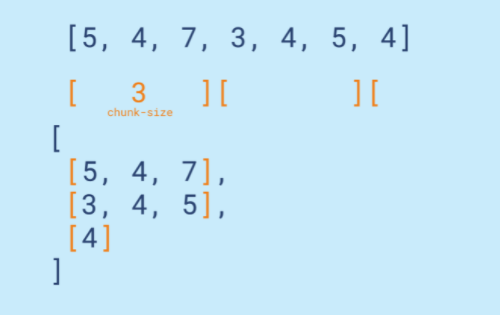

# Homework 8 - Collaboration

This week homework, required you to work in group, each member in the group must contribute something to the work.

Your group should setup a git-repository for this week homework, each group is responsible to solve the 5 exercises listed below.

How individual handle each exercise should be up to your group to decide. However, to show your contribution, you must use pull-request feature on git-hub to merge your answer with other group member.

Example:



Answer to each exercise to located on a separated file, naming ex: exercise-1.py, exercise-2.py … etc.

To submit this week homework, please copy your group week 6 homework github repository and paste as a url submission


Note: only 1 member in the group require to submit this exercise.

Exercise 1 - **2pts**
In a given list the last element should become the first one. An empty list or list with only one element should stay the same



Example:
replace_last([2, 3, 4, 1]) == [1, 2, 3, 4]
replace_last([1, 2, 3, 4]) == [4, 1, 2, 3]
replace_last([1]) == [1]
replace_last([]) == []
ref: https://py.checkio.org/en/mission/replace-last/Links to an external site.

Exercise 2 - **2pts**
You are given an array with positive numbers and a number N. You should find the N-th power of the element in the array with the index N. If N is outside of the array, then return -1. Don't forget that the first element has the index 0.

Let's look at a few examples:

- array = [1, 2, 3, 4] and N = 2, then the result is 3 2 == 9;
- array = [1, 2, 3] and N = 3, but N is outside of the array, so the result is -1.

Input: Two arguments. An array as a list of integers and a number as a integer.

Output: The result as an integer.

Example:

```
index_power([1, 2, 3, 4], 2) == 9
index_power([1, 3, 10, 100], 3) == 1000000
index_power([0, 1], 0) == 1
index_power([1, 2], 3) == -1

```

ref: https://py.checkio.org/en/mission/index-power/Links to an external site.

Exercise 3 - **2pts**
Not all of the elements are important. What you need to do here is to remove all of the elements after the given one from list.



For illustration, we have an list [1, 2, 3, 4, 5] and we need to remove all the elements that go after 3 - which is 4 and 5.

We have two edge cases here: (1) if a cutting element cannot be found, then the list shouldn't be changed; (2) if the list is empty, then it should remain empty.

Input: List and the border element.

Output: Iterable (list).

Example:

```
remove_all_after([1, 2, 3, 4, 5], 3) == [1, 2, 3]
remove_all_after([1, 1, 2, 2, 3, 3], 2) == [1, 1, 2]

```

ref: https://py.checkio.org/en/mission/remove-all-after/Links to an external site.

Exercise 4 - 2pts
You have a lot of work to do, so you might want to split it into smaller pieces. This way you'll know which piece you'll do on Monday, which will be for Tuesday and so on.

Split a list into smaller lists of the same size (chunks). The last chunk can be smaller than the default chunk-size. If the list is empty, then you shouldn't have any chunks at all.



Input: Two arguments. A List and chunk size.

Output: An Iterable with chunked Iterable.

Example:

```
chunking_by([5, 4, 7, 3, 4, 5, 4], 3) == [[5, 4, 7], [3, 4, 5], [4]]
chunking_by([3, 4, 5], 1) == [[3], [4], [5]]

```

ref: https://py.checkio.org/en/mission/chunk/Links to an external site.

Exercise 5 - 2pts
In a given string you should reverse every word, but the words should stay in their places.

Input: A string.

Output: A string.

Example:

```
backward_string_by_word('') == ''
backward_string_by_word('world') == 'dlrow'
backward_string_by_word('hello world') == 'olleh dlrow'
backward_string_by_word('hello world') == 'olleh dlrow'
```

ref: https://py.checkio.org/en/mission/backward-each-word/Links to an external site.
